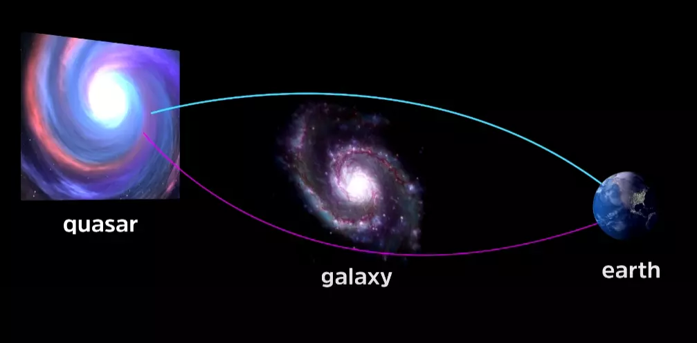

> Recognition [of the nature of mind] isn't a thing. It doesn't start at a certain moment and end therefore at a certain moment. It always has been. Mind has always recognized itself. Only _you_ haven't. As long as you think you're a _you_, you're gonna miss this. Because you're separating yourself from the mind that recognizes mind. So you have to relax. And keep practicing. By relaxing and practicing, at some point you will find the... I'm going to put it in words that aren't quite accurate. The aspect of yourself, of the totality of yourself, which has always known... **when you find that, then of course you _will_ have always known, even though you don't _now_ have always known.** — Lama Lena on Dzogchen

How could it be true that at some point in the future, you _will have always known_ something, even though it is not presently true that you have always known it? It doesn't make any logical sense. And yet for anyone who has had this (non-)experience, it is clear as day. Notice how it is reminiscent of the following idea from quantum mechanics.

In John Wheeler's [delayed choice experiment](https://en.wikipedia.org/wiki/Wheeler%27s_delayed-choice_experiment), light is traveling from a very distant quasar to Earth. Due to gravitational lensing, it might have taken one of two paths, having been warped by a galaxy in-between us and the source.

While it is on its many-year voyage, it is in a _superposition_ of both states — that is, it hasn't taken one definite path, but a quantum combination of the two. As it arrives on Earth, you can either choose to measure "which-path" information, revealing that it actually took only _one_ of the paths; or to allow the paths to interfere, suggesting that it took both paths. Don't worry about the details. What's important is that while it is in flight, we _cannot_ say that the photon is on just one path (or else you could not do interferometry upon arrival), but if you choose to measure its path, then after that point we _must_ say that it _was always only on that path_. In other words, during its flight, there is something that _will have been_ true even though it is not presently true.

> A quantum can go both routes or it can go a single route. And it's possible to choose which, after the particle has already made its travel. You choose — after the particle has decided whether it's going both routes or one route, and after it's got through — you yourself decide which **it shall have done**. You seem to intervene to change the past. But quantum theory says it can be done. [...] You can make the decision after it's already made the trip. That sounds like a contradiction, but it works. — [John Wheeler](https://www.youtube.com/watch?v=u54IPWqF6no)

To be clear, I am not making the facile claim that Buddhism = quantum mechanics or any such thing. But the reason underlying both of these phenomena is the same: _time is an illusion._ We naively imagine that reality is a fixed entity progressing through a concrete thing called "time," after which there becomes a definite (and singular) record of it etched into what we call the "past" — but this is nonsense. All we have are certain "consistency guarantees" that enable our reality to _appear_ internally consistent. In fact, it is the existence of such guarantees that makes us call certain realms "reality" and others "dreams." There are also adjacent realms that are almost-but-not-quite "reality," where such "guarantees" break down. They can be visited under certain conditions — though I do not necessarily recommend doing so, as such guarantees constitute the very basis of your sanity. The benefit of visiting them is to realize that there are ultimately no constraints anywhere on "reality." It is completely free. This realization can be either profoundly liberating or deeply terrifying, depending on the preparation of your mind and its tendency for fixation.

> He’d say things like, “In the end, the only law is that there is no law.” There’s no ultimate law of physics. All the laws of physics are mutable and that mutability itself is a principle of physics. He’d say, there’s no law of physics that hasn’t been transcended. — [Chris Fuchs, student of John Wheeler](https://www.quantamagazine.org/quantum-bayesianism-explained-by-its-founder-20150604/)

You can discover all of this scientifically and objectively, or directly and subjectively. Ultimately, even the objective-subjective boundary breaks down — which is itself another discovery that both quantum mechanics and meditative practice reveal in their own ways.
