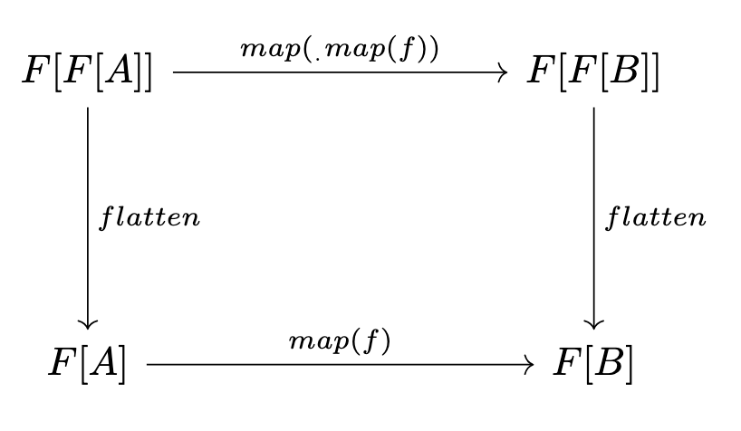

# Free monads (in Scala)

This article assumes familiarity with Scala, and in particular, functors and monads.

This article explains an implementation of the _free monad_ in Scala. To understand what the free monad is used for, read [this excellent article](https://rockthejvm.com/articles/free-monads-in-scala) or watch this [awesome talk](https://www.youtube.com/watch?v=M258zVn4m2M). The brief version is that it allows us to describe the _structure_ of a program without giving it an implementation, by making use of monads (roughly, objects with `flatMap`) — but without our description language itself needing to be monadic. Instead, there is a way to take any such description language and "lift" it into the most generic monad possible (the so-called "free monad"), for interpretation later. And the only reason this works is that our monad is indeed "free" — that is, it genuinely is the most generic monad possible, thus allowing it to be transformed into any other specific monad later.

That's a lot, so let's unpack it. In the article above, they use the example of a `DBOps` trait, which describes interactions with a hypothetical DB (but without providing any implementation):

```scala
trait DBOps[A] // `A` is the type "returned" by the DBOps
case class Create[A](key: String, value: A) extends DBOps[Unit]
case class Read[A](key: String) extends DBOps[A]
case class Update[A](key: String, value: A) extends DBOps[A]
case class Delete(key: String) extends DBOps[Unit]
```

We call `DBOps` an [algebraic data type](https://en.wikipedia.org/wiki/Algebraic_data_type), or ADT. What we'd like is to be able to write "programs" that look like this:
```scala
  def myLittleProgram: DBMonad[Unit] = for {
    name <- Get[String]("123-456")
    _    <- Create[String]("567", name.toUpperCase())
    _    <- Delete("123-456")
  } yield ()
```

Which Scala will de-sugar to this:
```scala
Get[String]("123-456").flatMap { name =>
  Create[String]("567", name.toUpperCase()).flatMap { _ =>
    Delete("123-456").map { _ =>
      ()
    }
  }
}
```

Unfortunately, this won't compile, because there is no `flatMap` defined on `DBOps` — it's not a _monad_. (Actually, just having a `flatMap` wouldn't be sufficient; it would also have to obey monadic laws like associativity — but the compiler can't enforce that.) But there should still be a way to make this work. After all, the _intent_ is clear: the program is meant to `get` a value (however it does that) and then pass the result to `create` etc. How do we do that? We would need to provide an implementation of `flatMap` that effectively just stores the _structure_ of this program for evaluation later — ideally in a way that that doesn't depend on the particulars of `DBOps`, so that it can be reused. That's where the free monad comes in.

Before we implement it, let's see what "free" means by looking at a simpler example of a free algebraic structure.

---

## Free monoids

Recall that a monoid is a set `S` with an identity element `e` and a binary operation `⊗` that has the following properties:

```
a ⊗ e = e ⊗ a = e for all a (the identity law)
(a ⊗ b) ⊗ c = a ⊗ (b ⊗ c) for all a, b, c (associativity)
```

An example of a monoid is the set of integers with `0` as the identity and `+` as the operation. A _different_ monoid is the integers with `1` as the identity and `*` (times) as the operation. Notice that they have the same underlying set.

Now suppose you are given a monoid where you're only told what the underlying set is (in this case, integers), but the operation (let's label it `�`) is kept secret. Then suppose you were given an expression like this:

```
4 � ((1 � 3) � 8)
```

What could you _do_ with it? Well, not much, since you don't actually know anything about how the operation works. Can you combine the 1 with the 3, leaving only the 3? Well that depends on the details of the operation (e.g., for multiplication you could, but for addition you could not) — and you don't know the details of the operation yet.

But one thing you _could_ do is remove the parentheses, because the associative law applies to all monoids. You couldn't reorder the numbers, because monoids aren't necessarily commutative. What you'd end up with is basically just a list of numbers:

```
4 � 1 � 3 � 8
```

which could be stored very simply: `[4, 1, 3, 8]`. Then, later, someone could provide the specific implementation of that operator (`+` or `*`, for example), and you could evaluate the expression.

So a **list** is the simplest way to store general monoidal expressions, _free_ of interpretation. In short, we say that the list is (or corresponds to) the "free monoid." Notice that something simpler like a set wouldn't have enough structure (since you'd lose ordering), and something more complex like a tree would contain unnecessary structure.

---

## Free monads

In the case of free monads, the situation is analogous but slightly different. We start with a functor `F`, which we want to turn into a monad in the most general way possible — that is, we want to equip it with a `flatMap`, but without having to define its behavior in advance. (For arcane reasons[^coyoneda], it turns out that we don't even need a functor; a _type constructor_ will do — for example, our `DBOps`, which can turn a generic type `A` into a `DBOps[A]`. This confused me at first. Actually it still does.)

[^coyoneda]: https://stackoverflow.com/a/67690282/5175433
    > The classical encoding of Free[F, *] is a monad only if F is a functor, so you needed the extra Blah => A member for each case. Then we figured out that you could use Free[Coyoneda[F, *], *] and get that machinery for free. Then we figured out how to just bake it into Free, so you don’t need to do any of that most of the time. But if you need to walk through your computation step by step you do need one of those encodings because F still needs to be a Functor in that case.

    Also see [this excellent answer on Reddit](https://www.reddit.com/r/scala/comments/15zfywk/comment/jxivfig/).

So what we can do is create a `FlatMap` class that stores the structure of our programs. Basically, it lets us store a statement like `a.flatMap(f)` as an object `FlatMap(a, f)`. As we shall see, we also need a way of storing "pure" values like `a` in a wrapper class — that is, we store `a` as `Pure(a)`. Both of these will extend a type `Free`, which has generic types indicating the functor (`F`) and the resulting type `A`:

```scala
sealed trait Free[F[_], A]
case class Pure[F[_], A](a: A)                              extends Free[F, A]
case class FlatMap[F[_], A, B](a: F[A], f: A => Free[F, B]) extends Free[F, B]
```

Then, we could hand-write our above program as:

```scala
FlatMap(Get[String]("123-456"), name =>
  FlatMap(Create[String]("567", name.toUpperCase()), _ =>
    FlatMap(Delete("123-456"), _ =>
      // Here we use the fact that map() can be replaced by flatMap if we "lift" its argument.
      // E.g., myList.map(_ + 1) = myList.flatMap(List(_ + 1)) — or rather, myList.flatMap(x => List(x + 1)) given how "_" evaluates.
      Pure(())
    )
  )
) 
```

As an aside, notice how this looks kind of like a [recursively-defined list](https://en.wikipedia.org/wiki/CAR_and_CDR): there's a _head_ (like `Get`) and the _remainder_ (`name => FlatMap(...)`). That's sort of the first punchline: the free monad is effectively just a list. This is no coincidence, since [monads famously _are_ monoids (in the category of endofunctors)](https://stackoverflow.com/questions/3870088/a-monad-is-just-a-monoid-in-the-category-of-endofunctors-whats-the-problem).

But we don't want to be writing these nested messes by hand. We want the _compiler_ to generate this for us, given the for-comprehension from before. But how? We can't store objects like `Get` in `Pure`, because `Pure` takes an `A`, and `Get` is an `F[A]` (it is an instance of the pseudo-functor `DBOps`).

We notice that for any `a` of monadic type `M`, trivially `a = a.flatMap(M.pure(_))` (where `M.pure` is the function, required by monad laws, that effectively just stores the input). For example, 

```List(1, 2, 3) = List(1, 2, 3).flatMap(List(_))```

or, replacing `flatMap` with `map` followed by `flatten`,

```List(1, 2, 3).map(List(_)).flatten = List(List(1), List(2), List(3)).flatten = List(1, 2, 3)```

So, using our above types, we can write our original for-comprehension as:

```scala
  def myLittleProgram: DBMonad[Unit] = for {
    name <- FlatMap(Get[String]("123-456"), Pure(_))
    _    <- FlatMap(Create[String]("567", name.toUpperCase()), Pure(_))
    _    <- FlatMap(Delete("123-456"), Pure(_))
  } yield ()
```

Of course, in practice, we'd want an `implicit` conversion like so, so that we don't have to do this by hand:

```scala
  implicit def liftF[F[_], A](fa: F[A]): Free[F, A] = FlatMap[F, A, A](fa, Pure(_))
```

Now our for-comprehension would get turned into:
```scala
FlatMap(Get[String]("123-456"), Pure(_)).flatMap { name =>
  FlatMap(Create[String]("567", name.toUpperCase()), Pure(_)).flatMap { _ =>
    FlatMap(Delete("123-456"), Pure(_)).flatMap { _ =>
      Pure(())
    }
  }
}
```

We're still not there, because this isn't yet a single object that we can store; it has `flatMap`s being applied. What we need is to provide an implementation of `flatMap` that does the right thing and simplifies it into the hand-written version. This is a bit clever. The monadic laws tell us that `flatMap` must be associative. Namely:
```scala
(a flatMap f(_)) flatMap g = a flatMap (f(_) flatMap g)
```

(Recall that `f(_)` expands to `x => f(x)`, and so the `f(_)` on the left is just `f` — but `f(_) flatMap g` is `x => (f(x) flatMap g)`, not `(x => f(x)) flatMap g` = `f flatMap g`, which would be a type error.)

So these two are equivalent:
```scala
FlatMap(Get[String]("123-456"), Pure(_)).flatMap(f)
FlatMap(Get[String]("123-456"), Pure(_).flatMap(f)) // The .flatMap(f) got "pulled in"
```

We also know that taking an `a`, wrapping it in a pure monad, and then `flatMapping` it with `f` is the same thing as simply invoking `f(a)`. That is, `Pure(a).flatMap(f) = f(a)`. For example, `List(1).flatMap(x => List(x + 1)) = List(2)`, which is the same as just taking `1`and applying `x => List(x + 1)` to it directly. That gives us the implementations for `flatMap` on both `FlatMap` and `Pure`:

```scala
sealed trait Free[F[_], A] {
  def flatMap[B](f: A => Free[F, B]): Free[F, B] = this match {
    case Pure(a)       => f(a)
    case FlatMap(a, g) => FlatMap(a, g(_) flatMap f)
  }
}
```

(Though one thing that confused me in Rúnar's talk is that instead of implementing it as `f(_) flatMap g`, he wrote `f andThen (_ flatMap g)`. It took me a minute to see that these are equivalent[^andThen]).

[^andThen]:
```scala
    f andThen (_ flatMap g)
    f andThen (a => a flatMap g)
    x => f(x) andThen (a => a flatMap g)
    x => (f(x) andThen (a => a flatMap g))
    x => (a => a flatMap g)(f(x))
    x => f(x) flatMap g
    f(_) flatMap g
    ```

It may be a bit tricky to see at first, but by applying these definitions, our for-comprehension will simplify to the hand-written one. Notice that the `flatMap`s on `FlatMap` "pull their arguments in":
```scala
FlatMap(Get[String]("123-456"), Pure(_).flatMap { name =>
  FlatMap(Create[String]("567", name.toUpperCase()), Pure(_).flatMap { _ =>
    FlatMap(Delete("123-456"), Pure(_).flatMap { _ =>
      Pure(())
    })
  })
})
```

And then notice how these simplify:

```scala
Pure(_).flatMap(a => foo(a))
x => Pure(x).flatMap(a => foo(a))
(a => foo(a))(x)
x => foo(x)
a => foo(a)
```

So that the `Pure(_).flatMap(...)` parts just disappear. So we indeed arrive at the desired result:

```scala
FlatMap(Get[String]("123-456"), name =>
  FlatMap(Create[String]("567", name.toUpperCase()), _ =>
    FlatMap(Delete("123-456"), _ =>
      Pure(())
    )
  )
) 
```

Voila!

All that's left to make our free monad functional is to provide translations from our functor (or ADT, like `DBOps`) to its actual implementations. You can see how this is done starting with Rúnar's slides at 17:00, and I'll omit the description here.

## An alternative implementation

There's another impl that I've seen before, that took me a while to get my head around. It looks like this:
```scala
sealed trait Free[F[_], A]
final case class Pure[F[_], A](a: A)                 extends Free[F, A]
final case class Flatten[F[_], A](ff: F[Free[F, A]]) extends Free[F, A] // Represents ff.flatten
```

Instead of a `FlatMap`, it has a `Flatten`. Monads can be defined using either `map` and `flatten` or just `flatMap`, so this ought to work. In fact, the standard mathematical definition of a monad is given in terms of the above two types. The first takes _zero_ applications of the functor and lifts it into one; the second takes _two_ applications and reduces it to one. In the same way, a monoid has an operation that combines two elements to one, and an identity element — which can be thought of an operation that takes zero elements and produces the identity element. This is _why_ a monad is just a monoid.

The tricky part is implementing `flatMap` (or just `map`) on `Flatten`. Suppose you have some nested functor value `ff: F[F[_]]` whose flattened value you want to map. Category theory tells us that these must be equivalent:
```scala
ff.flatten.map(f)
ff.map(_.map(f)).flatten
```

That is, it doesn't matter whether you apply `f` to the nested elements first and then flatten, or flatten first
and then apply `f`. For example:
```scala
val ff = List(List(1, 2), List(3, 4))
val f = (x: Int) => x * 2

// These are equivalent:
ff.flatten.map(f)                  // List(2, 4, 6, 8)
ff.map(_.map(f)).flatten           // List(2, 4, 6, 8)
```

This is represented by a "naturality diagram" (between functors `F[F[-]]` and `F[-]`) which tells us that going right and then down must be the same as going down and then right:

<p align="center" width="100%"></p>

This gives us the recursive definition of `map` that we're looking for, because these are equivalent:
```scala
Flatten(ff).map(f)         // map defined on Flatten
Flatten(ff.map(_.map(f)))  // uses the map defined on the underlying functor F
```

To see a full implementation (which isn't mine), check [this](https://scastie.scala-lang.org/MateuszKubuszok/JhOHaptTR2u8miLuzDHgYQ/13) out, linked from [here](https://www.reddit.com/r/scala/comments/15zfywk/comment/jxhk23a/).

---

## Other resources

https://nrinaudo.github.io/articles/free_monad.html
